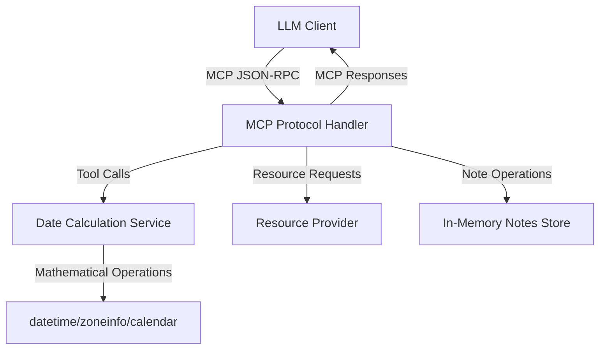

# 기술 요구 사항 문서 (TRD)

## 1. 기술 총괄 요약
- **프로젝트 개요**  
  MCP(Model Context Protocol) 서버는 LLM이 필요할 때 호출할 수 있는 **순수 날짜 계산 도구**를 제공하는 MCP 프로토콜 기반 서버이다. 자연어 파싱 대신 정확한 수학적 날짜 연산을 제공하며, 기존 레포지토리(datetime-mcp-server)를 포크하여 표준 MCP 서버로 구현한다. Docker/Podman 이미지로 배포된다.  
- **핵심 기술 스택**  
  Python 3.12, MCP(Server/Client), Pydantic, datetime/zoneinfo/calendar (표준 라이브러리), asyncio, uv(패키지 관리)  
- **주요 기술 목표**  
  ‑ p95 ≤ 50 ms 응답 시간 (파싱 방식보다 빠름)  
  ‑ 100% 수학적 정확도 (파싱 오류 없음)  
  ‑ 무상태(stateless) 설계로 1000 QPS까지 선형 확장  
- **중대한 기술 가정**  
  ‑ 자연어 파싱 없음 - 모든 연산은 수학적 계산  
  ‑ 표준 라이브러리 중심 설계로 의존성 최소화  
  ‑ MCP 1.0 프로토콜 완전 준수  

## 2. 기술 스택

| 범주 | 기술 / 라이브러리 | 선정 이유 |
| --- | --- | --- |
| 언어 | Python 3.12 | 팀 역량, 풍부한 표준 날짜 라이브러리, 비동기 지원 |
| MCP 프레임워크 | 자체 구현(server.py) | MCP 1.0 프로토콜 직접 구현, 오버엔지니어링 방지 |
| MCP 프로토콜 | JSON-RPC over stdio/HTTP | 표준 MCP 통신 방식 |
| 날짜 계산 | datetime, zoneinfo, calendar | 표준 라이브러리, 수학적 정확성, 외부 의존성 없음 |
| 데이터 검증 | Pydantic v2 | 타입 변환, 스키마 검증, MCP 메시지 유효성 |
| HTTP 클라이언트 | HTTPX | async/await 기반 SDK 구현에 적합 |
| LLM 클라이언트 | anthropic | Claude API 통합, MCP 클라이언트 구현 |
| 런타임 | asyncio | MCP 프로토콜의 비동기 특성에 최적화 |
| 패키지 관리 | uv, pyproject.toml | monorepo, 잠금파일로 재현성 확보 |
| 린팅/포매팅 | ruff | 빠른 Python 린터/포매터, Black/Flake8 대체 |
| 타입 체킹 | pyright | Microsoft의 정적 타입 분석기, async 코드 지원 |
| 코드 품질 | pre-commit | Git hooks를 통한 자동 코드 품질 검사 |
| 컨테이너 | Dockerfile, Podman 호환 | 배포 표준화, CI/CD 용이 |
| 테스트 | pytest, pytest-asyncio | 비동기 함수 테스트 지원 |
| 테스트 플러그인 | pytest-cov, pytest-mock, pytest-httpx | 커버리지, 모킹, HTTP 테스트 지원 |
| 테스트 커버리지 | coverage[toml] | 코드 커버리지 측정 및 리포팅 |
| 다중 환경 테스트 | tox-uv | 여러 Python 버전에서 테스트 실행 |
| CI/CD | GitHub Actions | 무료 러너, OSS 친화적 |
| 문서화 | Markdown, MkDocs | 가벼운 정적 문서 사이트 생성 |

## 3. 시스템 아키텍처 설계

### 상위 빌딩 블록
- **MCP Protocol Handler**  
  JSON-RPC over stdio/HTTP를 통한 MCP 메시지 처리
- **Date Calculation Service**  
  표준 라이브러리 기반 순수 수학적 날짜 연산
- **MCP Resource Provider**  
  현재 시간, 타임존 정보, 지원 타임존 목록 제공
- **MCP Tool Registry**  
  날짜 계산, 포맷팅, 비즈니스 데이 계산 도구들
- **Note Management Module**  
  인-메모리 Dict로 간단한 노트 CRUD 제공
- **Client SDK**  
  MCP 프로토콜 기반 클라이언트 세션, 도구 호출 헬퍼
- **CI/CD & 배포**  
  GitHub Actions → Docker Hub 이미지 빌드·푸시

### 상위 컴포넌트 상호작용 다이어그램


- LLM Client가 MCP 프로토콜로 도구 호출 요청  
- MCP Protocol Handler가 요청을 적절한 서비스로 라우팅  
- Date Calculation Service가 표준 라이브러리로 수학적 연산 수행  
- 계산 결과를 MCP 응답으로 반환  

### 코드 조직 & 컨벤션

**도메인 중심 조직 전략**
- **도메인 분리**: `datetime_tools`, `notes`, `protocol` 서브패키지로 경계 설정
- **레이어 분리**: `mcp`(protocol) ↔ `services`(비즈니스) ↔ `tools`(계산)
- **기능 기반 모듈**: 각 도메인 내부에 calculator, formatter, validator 동거
- **공유 컴포넌트**: `common` 패키지에 유틸, 예외, 설정

**디렉터리 구조**
```
/
├── pyproject.toml
├── README.md
├── Dockerfile
├── .github/
│   └── workflows/ci.yml
├── src/
│   ├── datetime_mcp_server/
│   │   ├── __init__.py
│   │   ├── server.py         # MCP 프로토콜 구현
│   │   ├── client.py         # MCP 클라이언트
│   │   ├── tools/
│   │   │   ├── datetime_tools.py
│   │   │   ├── business_days.py
│   │   │   └── formatters.py
│   │   ├── services/
│   │   │   ├── date_calculator.py
│   │   │   └── note_service.py
│   │   ├── resources/
│   │   │   └── datetime_resources.py
│   │   ├── prompts/
│   │   │   └── datetime_prompts.py
│   │   └── common/
│   │       ├── config.py
│   │       ├── schemas.py
│   │       └── errors.py
└── tests/
    ├── test_tools.py
    ├── test_calculations.py
    └── test_mcp_protocol.py
```

### 데이터 흐름 & 통신 패턴
- **LLM-서버 통신**  
  MCP JSON-RPC over stdio → `call_tool("calculate-date", {...})` → 수학적 날짜 계산 → JSON 응답  
- **도구 호출 패턴**  
  `calculate-date-range("2024-07-15", "last", 3, "months")` → `{"start": "2024-04-15", "end": "2024-07-15"}`  
- **저장소 인터랙션**  
  노트 관리 시 `memory_store.NoteRepository` 호출, 앱 종료 시 데이터 휘발  
- **외부 서비스 통합**  
  없음(표준 라이브러리만 사용)  
- **실시간 통신**  
  향후 bulk 계산을 위한 스트림 옵션 고려  
- **데이터 동기화**  
  완전 무상태 설계, 인스턴스간 동기화 불필요  

## 4. 성능 & 최적화 전략
- 비동기 MCP 프로토콜 핸들링으로 동시성 극대화  
- 계산 결과 LRU 캐싱(1K 엔트리)으로 반복 요청 응답 향상  
- 표준 라이브러리 사용으로 파싱 오버헤드 제거  
- pytest-benchmark로 회귀 성능 측정, p95 ≤ 50ms 자동 경고  
- 수학적 연산만 수행하므로 CPU 효율성 극대화  

## 5. MCP 도구 명세

### Core Date Calculation Tools

1. **get-current-datetime**
   ```json
   {
     "name": "get-current-datetime",
     "description": "Get current date and time in specified timezone and format",
     "inputSchema": {
       "type": "object",
       "properties": {
         "timezone": {"type": "string", "default": "UTC"},
         "format": {"type": "string", "enum": ["iso", "rfc3339", "unix", "readable"]}
       }
     }
   }
   ```

2. **calculate-date**
   ```json
   {
     "name": "calculate-date", 
     "description": "Add or subtract time from a date",
     "inputSchema": {
       "type": "object",
       "properties": {
         "base_date": {"type": "string", "format": "date"},
         "operation": {"type": "string", "enum": ["add", "subtract"]},
         "amount": {"type": "integer"},
         "unit": {"type": "string", "enum": ["days", "weeks", "months", "years"]}
       },
       "required": ["base_date", "operation", "amount", "unit"]
     }
   }
   ```

3. **calculate-date-range**
   ```json
   {
     "name": "calculate-date-range",
     "description": "Calculate start and end dates for a time period",
     "inputSchema": {
       "type": "object", 
       "properties": {
         "reference_date": {"type": "string", "format": "date"},
         "direction": {"type": "string", "enum": ["last", "next"]},
         "amount": {"type": "integer"},
         "unit": {"type": "string", "enum": ["days", "weeks", "months", "years"]}
       },
       "required": ["reference_date", "direction", "amount", "unit"]
     }
   }
   ```

4. **calculate-business-days**
   ```json
   {
     "name": "calculate-business-days",
     "description": "Calculate business days between dates",
     "inputSchema": {
       "type": "object",
       "properties": {
         "start_date": {"type": "string", "format": "date"},
         "end_date": {"type": "string", "format": "date"},
         "holidays": {"type": "array", "items": {"type": "string", "format": "date"}},
         "weekend_pattern": {"type": "string", "enum": ["sat-sun", "fri-sat"], "default": "sat-sun"}
       },
       "required": ["start_date", "end_date"]
     }
   }
   ```

## 6. 구현 로드맵 & 마일스톤

### Phase 1: 기초 (MVP)
- MCP 프로토콜 핸들러, 기본 날짜 계산 도구 구현
- get-current-datetime, calculate-date 도구 완성
- 인-메모리 노트 CRUD, 표준 라이브러리 기반 계산 엔진
- GitHub Actions: lint(pyright) + 테스트 + 이미지 빌드
- 기간: 2025-08-15 (M1)

### Phase 2: 고급 기능
- calculate-date-range, calculate-business-days 도구 추가
- 타임존 처리, 비즈니스 데이 규칙 구현
- MCP 클라이언트 SDK, 종합적인 프롬프트 제공
- 성능 최적화, 캐싱 시스템 도입
- 기간: 2025-09-15 (M3)

### Phase 3: 엔터프라이즈 기능
- 고급 타임존 처리, DST 지원
- 커스텀 비즈니스 데이 캘린더
- 벌크 계산 최적화, 스트림 응답 베타
- MCP 1.0 컴플라이언스 검증
- 기간: 2025-10-01 (M4)

## 7. 위험 평가 & 완화 전략

### 기술 리스크
- **표준 라이브러리 변경**: Python 버전 호환성 → LTS 버전 사용, 테스트 자동화  
- **타임존 데이터 업데이트**: zoneinfo 데이터 변경 → 정기 Python 업데이트, UTC 폴백  
- **성능 병목**: 대량 계산 요청 → 캐싱, 비동기 처리 최적화  
- **MCP 프로토콜 변경**: MCP 스펙 업데이트 → 버전 호환성 유지, 점진적 마이그레이션  

### 프로젝트 전달 리스크
- **일정 지연**: Milestone별 PR 리뷰 체계화, 핵심 기능 우선순위  
- **정확성 검증**: 수학적 계산 검증을 위한 포괄적 테스트 슈트  
- **MCP 호환성**: MCP 1.0 스펙 준수 검증, 레퍼런스 구현과 비교  
- **배포 실패**: 컨테이너 기반 배포, 단계적 롤아웃  

---

